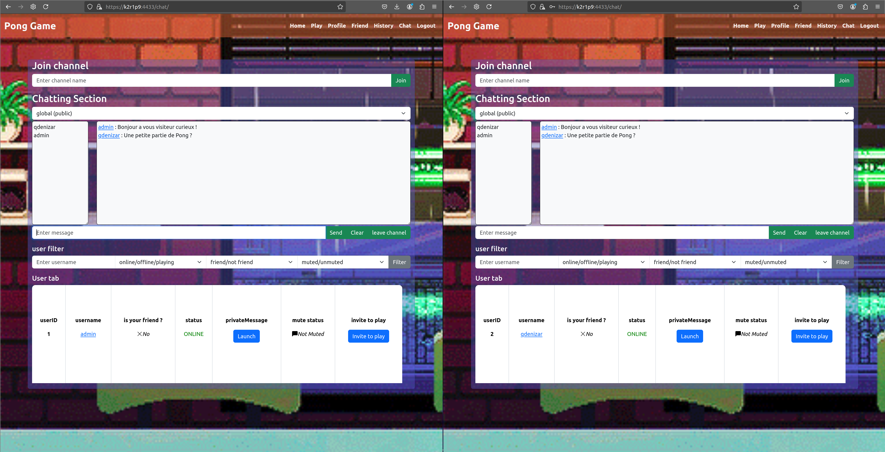

# Bienvenue sur le dépôt GitHub du projet Transcendence !
### Ce site permet aux utilisateurs de jouer à Pong entre eux en temps réel, d'utiliser un chat et de participer à des parties multijoueurs en ligne ou seul contre un bot.

Ce projet a ete realise en collaboration avec [iamdamla](https://github.com/iamdamla), [ChromaXard](https://github.com/ChromaXard) et [alexandre6795](https://github.com/alexandre6795)

## APERCU

<div>
  
  
  
  
  
<div>

## Installation et lancement:

Avant de vouloir compiler le projet, assurez vous d'avoir docker installe.
Il faut ensuite creer et remplir un fichier ".baseenv" a place dans le dossier "srcs".
Ce fichier va permettre de creer des variables d'environnement qui seront necessaire au bon fonctionnement du projet.
Ce fichier contiendra des informations de securite importante et ne peux donc pas etre push sur le repot.
Il doit etre rempli avec les variable suivantes:

- SECRET_KEY= Il s'agit d'une donnee cree a la creation de l'application django : 'django-insecure-zca#)s17gd%#uu8#mv(=o9g+ueuej7_&v_ngy5(5c#+qj6d=t7'
- DEBUG=False
- SERVER_NAME= Cette information ce completera automatiquement avec le makefile
- DJANGO_ALLOWED_HOSTS= Cette information ce completera automatiquement avec le makefile
- DJANGO_CSRF_TRUSTED_ORIGINS= Cette information ce completera automatiquement avec le makefile
- DJANGO_SUPERUSER_USERNAME= La creation du super user ayant acces a tout. ex : 'admin'
- DJANGO_SUPERUSER_PASSWORD= Son MDP. ex : 'admin/0123456789'
- DJANGO_SUPERUSER_EMAIL=ason adresse email. ex 'admin@admin.com'
- POSTGRES_DB= Le nom de la base de données PostgreSQL à utiliser. ex : 'trancendence'
- POSTGRES_USER=  Le nom de l'utilisateur pour se connecter à la base de données PostgreSQL. ex : 'admin'
- POSTGRES_PASSWORD=Le mot de passe pour l'utilisateur de la base de données PostgreSQL. ex : 'admin/0123456789'
- POSTGRES_HOST=postgres
- POSTGRES_PORT=5432
- INTRA_42_CLIENT_ID= Les identifiants client OAuth pour l'authentification via l'intranet 42. Ces valeurs sont fournies par l'API de 42 lors de l'enregistrement de votre application.
- INTRA_42_CLIENT_SECRET=Ces valeurs sont fournies par l'API de 42 lors de l'enregistrement de votre application.


Une fois l'environnemet cree et ajoute au projet, il vous suffit a la racine de celui ci d'utiliser la commande 
```
'make'
``` 
pour lancer le projet. 
POUR LE MOMENT le projet a ete concu pour fonctionner uniquement sur les postes de l'ecole 42. 
